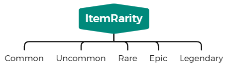
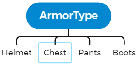
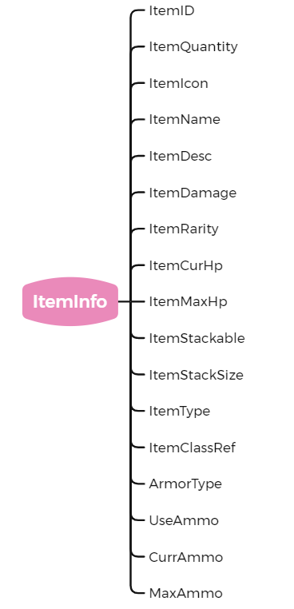

# SurvivalCraft

使用 Unreal Engine 5 制作的生存游戏Demo

## 基本数据结构

#### 物品类型

- 资源
- 可装备的

- 护甲

- 可消耗的
- 可建造的

#### 物品稀有度

- 常见的
- 不常见的
- 稀有的
- 史诗级
- 传说级

#### 护甲类型

- 头盔
- 上衣
- 裤子
- 鞋子

#### 物品结构

- 物品ID
- 物品数量
- 物品图标
- 物品名称
- 物品描述
- 物品伤害
- 物品稀有度
- 物品生命值(耐久度)
- 物品最大生命值(最大耐久度)
- 物品是否可堆叠
- 物品堆叠数量
- 物品类型
- 物品子类引用
- 护甲类型
- 使用弹药
- 当前弹药
- 最大弹药

##### *注意：附加网格体时，如果需要对拥有者不可见，需要确保附加的网格体禁用Nanite
